# 🍳 My Cheap Chef — Cook from Discounts
 
> **Status: 🚧 Work in Progress — core pipeline live, UI polish ongoing**

An AI-powered app that suggests recipes based on products currently on sale in supermarkets (Lidl, Kaufland — Slovakia). Save money and never wonder "What should I cook?" again.

## 🎯 Problem

- People don't know what to cook.
- They want to save money by buying discounted products.
- Nobody analyzes promotional catalogs from the cooking perspective.

## 💡 Solution

The app connects **supermarket discount catalogs** with **AI-generated recipes** — so every dish you cook is made from products that are currently on sale.

## 🧱 Architecture

```
my-cheap-chef/
├── src/
│   ├── app/              ← Next.js App Router (pages & UI)
│   │   └── api/          ← API Routes (Route Handlers)
│   ├── lib/              ← Shared types, utilities, constants
│   └── components/       ← (planned) React components
├── scripts/              ← Cron scripts (catalog parsing, recipe generation)
├── data/                 ← JSON data files (products, recipes, catalog images)
└── public/               ← Static assets
```

## 🛠 Tech Stack

| Layer | Technology |
|-------|-----------|
| Frontend | Next.js 16, React 19, CSS Modules |
| Backend | Next.js API Routes (Route Handlers) |
| Scripts | TypeScript (tsx), scheduled via GitHub Actions |
| AI | Google Gemini (`@google/genai`) — catalog parsing (Vision) + recipe generation (Text) |
| Data | JSON files (`data/*.json`) + append-only price history (`data/price-history.jsonl`) |
| Deployment | Vercel (planned) |

## 🎨 Dish Illustrations

We don't generate dish photos — they're unpredictable, often ugly, and cost money per recipe. Instead every dish gets a hand-drawn animated SVG scene, picked by **two independent axes**:

- `category` — what the dish *is* (`meat`, `pasta`, `soup`, `veggie`, `dessert`)
- `cookingMethod` — which vessel it's cooked in (`pan`, `oven`, `pot`, `raw`)



Empty cells are combinations that aren't real food (raw pasta, soup in a frying pan), and the generator is told not to produce them.

**Why two axes and not one.** `category` used to be the only field, which forced it to answer both questions at once. The result was visibly wrong icons: oven-roasted chicken is `meat`, `meat` mapped to a single frying-pan scene, so a roast was drawn in a pan. The reverse happened too — pan-fried cheese fell under the old `baked` value and was drawn as a roasting dish. Splitting the axes fixes both directions at once.

Two category values were retired into `veggie`: `baked`, which named a technique rather than a dish, and `salad`, which was simply `veggie` + `raw`.

**When a dish uses several vessels** (pasta boiled while the sauce fries, meat seared then roasted), the method is the vessel where the dish reaches its *final* state — seared-then-roasted pork is `oven`, not `pan`.

**No grill and no microwave**, deliberately: a grill isn't in every kitchen and we're aiming at the widest possible audience. The prompt forbids recipes that require one.

The valid pairs live in [`src/lib/cookingMethods.ts`](src/lib/cookingMethods.ts) and are shared by the generator and the UI. Scenes are in [`src/components/icons/dishes/scenes/`](src/components/icons/dishes/scenes), built on shared `OvenFrame` / `PotFrame` / `PanFrame` chassis so the same cookware can't drift between scenes. See [docs/RECIPE_GENERATION.md](docs/RECIPE_GENERATION.md) for the full reasoning.

## 🚀 Getting Started

### Prerequisites

- Node.js 18+
- npm

### Installation

```bash
git clone <repo-url>
cd my-cheap-chef
npm install
```

### Development

```bash
npm run dev
```

Open [http://localhost:3000](http://localhost:3000) in your browser.

### Available Scripts

| Command | Description |
|---------|-------------|
| `npm run dev` | Start development server |
| `npm run build` | Production build |
| `npm run start` | Production build + start |
| `npm run lint` | Run ESLint |
| `npm run weekly` | Full weekly pipeline: fetch → parse catalog → generate recipes |
| `npm run catalog:fetch` | Fetch the current Lidl flyer images |
| `npm run catalog:parse` | Parse flyer images into `data/catalog.json` via Vision AI |
| `npm run recipe:generate` | Generate `data/recipe.json` from the catalog via Gemini |

## 📊 Data Flow

1. **Weekly (Monday 2:00 UTC, GitHub Actions):** `npm run weekly` fetches the current flyer, parses it into `data/catalog.json`, and appends price points to `data/price-history.jsonl`.
2. **After parsing:** Recipes are generated from the catalog → `data/recipe.json`. If catalog parsing fails, the pipeline falls back to the live Lidl API on its own.
3. **Commit:** The workflow commits and pushes the updated data files (`[skip ci]`) when anything changed.
4. **Client:** Next.js pages read the JSON at request time —`/discounts` (products on sale), `/recipes` (AI-generated recipe of the week), `/catalog` (raw parsed catalog, internal/debug view).
5. **Paid feature (future):** On-demand recipe generation.

See [docs/CATALOG_INGESTION_PLAN.md](docs/CATALOG_INGESTION_PLAN.md) and [docs/RECIPE_GENERATION.md](docs/RECIPE_GENERATION.md) for the pipeline design.

## ✅ Roadmap

- [x] Catalog parsing via Vision AI
- [x] Recipe generation via Text AI (Gemini)
- [x] Weekly pipeline automated via GitHub Actions
- [x] UI: discounted products (`/discounts`) + recipe of the week (`/recipes`)
- [x] Price history tracking (`data/price-history.jsonl`)
- [ ] PWA support
- [ ] Deployment to Vercel
- [ ] Multi-store support (Kaufland, etc.)
- [ ] Filters (vegetarian, quick meals, no oven, etc.)
- [ ] Shopping list generation
- [ ] Geo expansion (Slovakia → Czechia → Poland → Germany)

## 📄 License

This project is private and not yet licensed for public distribution.
