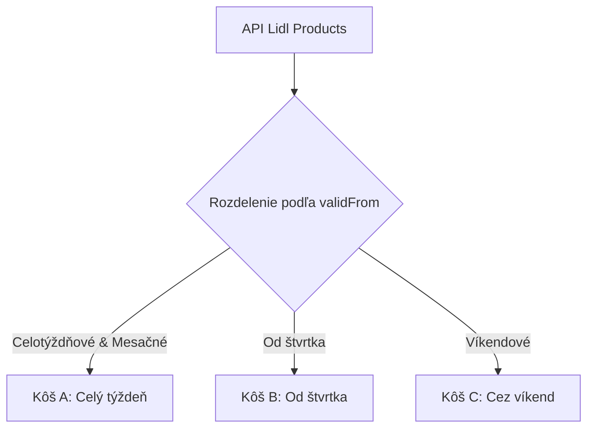

# Architektúra generovania receptov (Recipe System)

Tento dokument popisuje logiku rozdelenia akčných produktov do fáz (košov) a proces generovania 6 statických receptov na týždeň pre projekt **"Varím zo zliav"**.

---

## 1. Systém troch košov (A, B, C)

Aby sme vyriešili prekrývanie dátumov v API Lidla (napr. akcie platiace od pondelka, od štvrtka a super víkend), produkty sa programovo delia do troch košov na základe ich dátumu začiatku platnosti (`validFrom`).



### Logika rozradenia do košov (Helper):
```typescript
type BasketType = 'A' | 'B' | 'C';

export const getBasketForProduct = (validFrom: number | null, validUntil: number | null): BasketType => {
  if (!validFrom || !validUntil) return 'A';
  
  const date = new Date(validFrom * 1000);
  const dayOfWeek = date.getDay(); // 0 = Nedeľa, 1 = Pondelok, ..., 4 = Štvrtok, 6 = Sobota
  const durationDays = (validUntil - validFrom) / (24 * 3600);

  // 1. Dlhodobé akcie (týždenné, mesačné) -> Kôš A
  if (durationDays > 6) {
    return 'A';
  }

  // 2. Krátkodobé akcie začínajúce od štvrtka -> Kôš B
  if (dayOfWeek === 4) {
    return 'B';
  }

  // 3. Víkendové akcie (sobota - nedeľa) -> Kôš C
  if (dayOfWeek === 6 || dayOfWeek === 0) {
    return 'C';
  }

  // Fallback -> Kôš A
  return 'A';
};
```

---

## 2. Štruktúra 6 receptov (Evolúcia MVP)

Namiesto 3 receptov budeme generovať **6 receptov na týždeň** (po 2 pre každú fázu týždňa). To poskytne používateľom možnosť výberu (napr. ak jedno jedlo obsahuje mäso, ktoré nejedia).

### Pravidlá pre generovanie (AI constraints):

1. **Fáza A: Celý týždeň (Recepty 1 & 2)**
   * **Dostupnosť**: Od pondelka.
   * **Zdroje**: Iba produkty z **Koša A** + Základná špajza.
   * **Typy jedál**: Napr. jedno mäsové, jedno vegetariánske/sladké.

2. **Fáza B: Od štvrtka (Recepty 3 & 4)**
   * **Dostupnosť**: Od štvrtka.
   * **Zdroje**: Produkty z **Koša B** + **Koša A** + Základná špajza.
   * **Prečo**: Používateľ nakupujúci vo štvrtok má prístup k novým štvrtkovým akciám aj k stále platiacim celotýždňovým akciám.

3. **Fáza C: Víkendový špeciál (Recepty 5 & 6)**
   * **Dostupnosť**: Od soboty.
   * **Zdroje**: Produkty z **Koša C** + **Koša B** + **Koša A** + Základná špajza.
   * **Prečo**: Cez víkend sú aktívne všetky tri typy akcií.

---

## 3. Zmeny vo formáte dát

### A. Rozšírenie `products.json`
Do databázy produktov (ktorá slúži aj pre zobrazenie na webe) môžeme pridať pole `basket` pre jednoduchšie filtrovanie v UI bez nutnosti prepočítavania na klientovi:
```json
{
  "id": "10031715",
  "name": "Bravčová panenka",
  "price": 5.99,
  "oldPrice": 8.89,
  "packInfo": "cena za 1 kg",
  "imageUrl": "https://...",
  "category": "Food",
  "isLidlPlus": false,
  "validFrom": 1782943200,
  "validUntil": 1783288799,
  "dateLabel": "od 02.07. - 05.07.",
  "basket": "B"
}
```

### B. Formát `recipe.json`
```json
{
  "generatedAt": "2026-06-30T19:56:55Z",
  "recipes": [
    {
      "id": "recipe-a1",
      "basket": "A",
      "basketLabel": "Celý týždeň (od pondelka)",
      "title": "Názov jedla",
      "ingredients": ["surovina z obchodu 1", "surovina zo špajze 1"],
      "ingredientsFromSale": ["surovina z obchodu 1"],
      "steps": ["Krok 1", "Krok 2"],
      "estimatedTime": "30 min",
      "totalSavings": "2.40€"
    }
  ]
}
```

---

## 4. UI/UX Koncepcia pre 6 receptov

V aplikácii na hlavnej stránke namiesto jednoduchého zoznamu zobrazíme recepty prehľadne v taboch alebo sekciách:

1. **Tab 1: Pondelok - Streda** (Recepty A1, A2) — Aktívne hneď.
2. **Tab 2: Od štvrtka** (Recepty B1, B2) — Ak je pondelok, sú sivé s textom *"Bude dostupné od štvrtka (zlacnenie brokolicie/panenky)"*.
3. **Tab 3: Víkend** (Recepty C1, C2) — Cez týždeň sú sivé s textom *"Víkendový špeciál (od soboty)"*.

Týmto motivujeme používateľov naplánovať si nákupy a vrátiť sa do aplikácie neskôr v týždni.
